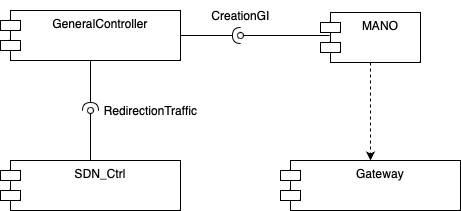
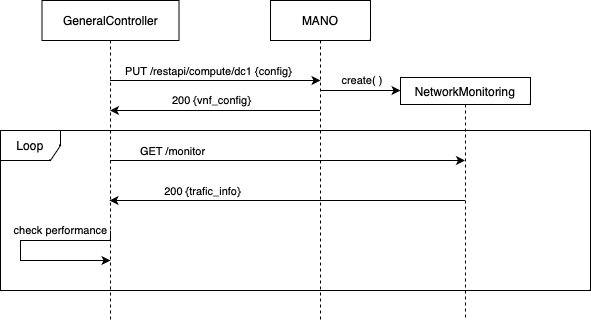
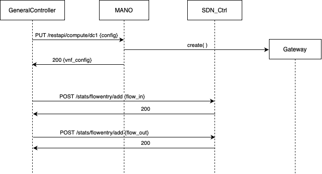

<div align="center">
  <a href="https://jodorganistaca/exploratory_analysis_dataviz">
    
  </a>
  <br/>
  <br/>
  <h3 align="center"> Software Defined Communication Infrastructure </h3>
  <h4 align="center"> Distribued System and Big Data - INSA Toulouse - 2022 </h3>
  <a href="https://www.github.com/TheoFontana">Théo Fontana</a>
  <span>, </span>
  <a href="https://www.github.com/jodorganistaca">Jose Organista</a>
</div>

<!-- ABOUT THE PROJECT -->
## Presentation du Projet

### Objectifs &

* Déployer dynamiquement et de façon transparente des fonctions de réseau virtuelles (VNF) 
  * permettant de répondre aux besoins fonctionnels et/ou non fonctionnels d’applications distribuées relevant d’une activité de l’Internet des objets (IoT)
  * en appliquant les concepts et techniques relevant de la virtualisation de fonctions de réseau (NFV) et des réseaux pilotables par le logiciel (SDN)
* Développer une approche de gestion autonome de la mise en œuvre des VNF ciblées via le concept de l’Autonomic Computing (AC)

### Activité IoT ciblée

Activité de supervision/intervention à distance sur differentes zones dotées de capteurs / actionneurs, par le biais d’applications


En cas d'incident dans une zone du trafic supplémentaore est généré par ses capteurs / actionneurs.
Ceci peut entrainer la saturation de la gateway intermediaire (GI) génerant ainsi une baisse de performances incompatible avec les besoins en QoS des applications.

Une phase d'adapation est alors necessaire pour retablir les performances. Plusieur stratégies peuvent être adopté :
* Déployer une seconde gateway sous forme de VNF et rediriger le trafaic provenant de la zone 1 (ou des zone 2 et 3) vers cette gateway.
* Déployer d'une VNF d'ordonnancement différencié priorisant le trafic issu de GF1.
* Supprimmer les flux de données en provenance de la zone 2 et 3.
* Déployer d'un loadbalancer sous forme de VNF.

### Vision IT de l'activité ciblée

Hypotèse sur l'infrastuture IT 

* GI, GF et DC sont connectés via un réseau grande distance (WAN) géré par un opérateur dont la portée d’action inclut : les noeuds internes du réseau (switch), les noeuds MW (GI et GF) et le DC
* Un orchestrateur de VNF (VNF-ORCH) est connecté au WAN : il permet de déployer des VNF sur le DC et de gérer leur cycle de vie.
* Le WAN est doté de capacités SDN :
  * Ses noeuds internes sont des switch SDN programmables via Open Flow
  * Il inclut un contrôleur SDN interagissant avec les switch SDN via Open Flow


### Plateforme et outils mis à disposition 

* Plateforme d’émulation de réseau : [ContainerNet](https://github.com/containernet/containernet)
* Controlleur SDN : [RYU](https://ryu-sdn.org)
  * [documentation](https://ryu.readthedocs.io/en/latest/app/ofctl_rest.html)
* MANO standardisé ETSI NFV : [OSM](https://osm.etsi.org)
* Middleware IoT/M2M en NodeJS (see [Middelware](https://github.com/TheoFontana/SDCI/tree/main/middleware))

### Travail demandé

Mettre en place l'adaptation requise lorsque la gateway intermediaire est saturée, suivant le cadre de l’Autonomic Computing

## Use cases étudiée

Notre groupe avait pour missiion de monitorer la gateway intermediaire pour surveiller sa charges à partir de metrique système tel que la charge du CPU.

Nous devions en suite en cas de dégradation des performance déployer une nouvelle gateway et redireiger le trafic en provenance de cette zone un 

## Conception des solutions








## Choix d'implementation
### Topologie deployé
Nous avons choisi de déployer le reseau suivant


Le reseau bleu est le réseau émulé mininet. Nous avons choisis de simuler les différentes zones avec un switch simulant un LAN. 

Le reseau vert repésente le réseaux VLAN Docker reliant tous nos container. Il est utilisé pour assuré les communication entre : 
* les instances et le metadata serveur
* le GC, le Mano, le controlleur SDN et les VNFs 

### Metadata serveur
Nous avons réalisé le metadata serveur en Node.js . Ce dernier se contente de renvoyer la configuartion de l'instance à deployer suite a une requette GET.

extarit de [metadata_server.js](./metadata_server/metadata_server.js)
```js
app.get('/:id', function(req, res) {
    var id = req.params.id;
    var conf_instance = config[id];
    if (conf_instance)
        res.status(E_OK).send(JSON.stringify(conf_instance));
    else
        res.sendStatus(E_NOT_FOUND);
});
```

L'ensemble des configuration est stocké dans un fichier geneneral de configuation [config.json](./metadata_server/config.json)

```json
{
...
"gwf_1": {
        "local_ip": "10.1.0.11",
        "local_port": 8282,
        "local_name": "gwf_1",
        "remote_ip": "10.1.0.10",
        "remote_port": 8181,
        "remote_name": "gwi",
        "file_URL":"https://homepages.laas.fr/smedjiah/tmp/mw/gateway.js"
    },
...
}
```

### General controlleur

Nous avons choisi de ne pas utiliser le squelette de general contriller fourni mais de développer un prototype plus simple *from scratch* en Python afain de nous facilité le  developpement et les tests.

Notre general controller lance la VNF de monitoring dans le datacenter au démarrage puis il rentre dans une boucle pour surveiller l'état du système de la gateway intermediaire. En cas ou les metrique surveiller depasse les seuils fixé, il lance le deploiement d'une nouvelle gateway intermediaire n-sous la forme d'une VNF et redirige le trafic de la zone 1 vers cette dernière.

### Monitoring
Notre startegie de monitoring est pour l'instant assez simple. Lorsqque notre VNF recoit une requette ```GET``` de la part du general controller elle interroge la gateway sur son endpoint ```/health``` et retourne la reponse reçu au GC. Cette stategie nous permet de deplacer le traitement de la réponse au niveau du GC celui si peut donc choisir à quel rythme monitorer la gateway ce qui peut reduire la charge 
```JS
app.get('/monitor', function(req, res) {
    request({method: 'GET', uri: `http://10.1.0.10:8181/health`}, (error, response, body) => {
        if (!error && response.statusCode == 200){
            res.send(body);
        } else {
            res.send(error);
        }
    });
});
```

Pour deployer la VNF, nous utilsons l'API REST de vim-emu 
```Python
def start_monitoring():
    # URL to add new vnf
    url = 'http://127.0.0.1:5001/restapi/compute/dc1/vnf_monitor'
    headers = {'Content-type': 'application/json'}
    d = {"image":"vnf_monitor:0.2", "network":"(id=vnf_monitor,ip=10.1.0.100/24)"}
    r = requests.put(url, headers = headers, data = json.dumps(d))
    return r.status_code, r.json()
```

Nous avons chois de basé notre monitoring sur la metrique ```currentLoadSystem``` car c'est elle qui semblait le plus varié rapidement losque nous simulions une charge sur la gateway lors de nos tests. Lorque celle ci depasse le seuil fixé, nous devons deployer notre VNF d'adpatation.

### Adaptation
La première étape de l'adapation est de deployer une nouvelle gateway intermediaire dans le datacenter en utilisant l'API REST de vim-emu. l'iamge de la gateway intermediaire precedement construit à du être légerement modifier pour qu'elle concovienne au requirement de vim-emu, le serveur node.js doit tourner de background et et les srcipts de démarage et d'arrêt de la VNF doivent être passé en variable d'environnement dans le Dockerfile.

Nous devons ensuite rediriger le trafic de la gateway final de la zone 1 à direction de la gateway intermidiaire vers notre VNF.

Nous avons pris la decision d'identider ce flux avec uniquement les adresse IP source et destinations. nous devons donc :
* modifier l'addresse IP destination des paquet provennat de ```GWF_1``` en direction de ```GWI``` *(aller)*
* modifier d'addresse IP srouce des paquets provennant de la ```GWI_VNF``` en direction en direction de ```GWF_1``` *(retour)*

Cela est réalisé en ajoutant des *flow* dans la table SDN du switch 2 à l'aide de l'API de controller SDN  de la façon suivante (pour l'aller)
```Json
curl -X POST -d '{
    "dpid": 2,
    "table_id":0,
    "priority":11111,
    "match":{
        "nw_src": "10.1.0.11",
        "nw_dst": "10.1.0.10",
        "dl_type": "2048",

    },
    "actions":[
        {
            "type": "SET_FIELD",
            "field": "ipv4_dst",
            "value": "10.1.0.60"
        },
        {
            "type": "OUTPUT",
            "port": "NORMAL"
        }
    ]
 }' http://localhost:8080/stats/flowentry/add
```
## Sénario de démonstation 

## Axes d'ameliorations

Actuellement nous voyons que suite au déploiment de notre VNF est à la redirection du  


## Conclusion