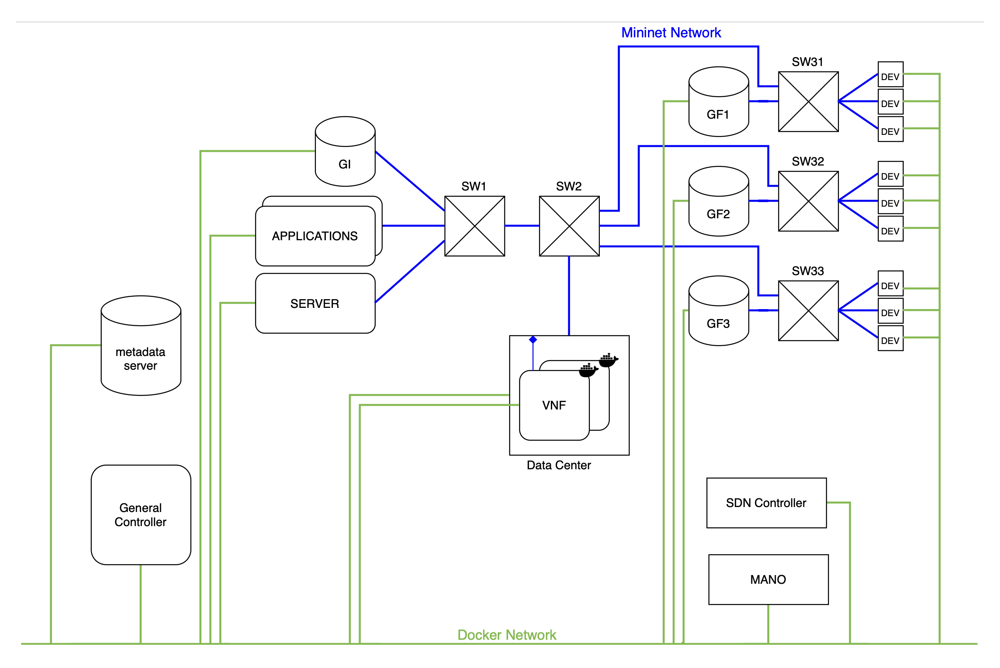

<div align="center">
  <a href="https://www.insa-toulouse.fr/">
    
  </a>
  <br/>
  <br/>
  <h3 align="center"> Software Defined Communication Infrastructure </h3>
  <h4 align="center"> Systèmes distribués et big data - INSA Toulouse - 2023 </h3>
  <a href="https://www.github.com/TheoFontana">Théo Fontana</a>
  <span>, </span>
  <a href="https://www.github.com/jodorganistaca">Jose Organista</a>
</div>

<!-- ABOUT THE PROJECT -->
## Presentation du Projet

Ce projet est réalisé dans le cadre de la mineur SDCI en dernière année de l'école d'ingenieur INSA en spécialité systèmes distribués et big data.

### Objectifs

* Déployer dynamiquement et de façon transparente des fonctions de réseau virtuelles (VNF) 
  * permettant de répondre aux besoins fonctionnels et/ou non fonctionnels d’applications distribuées relevant d’une activité de l’Internet des objets (IoT)
  * en appliquant les concepts et techniques relevant de la virtualisation de fonctions de réseau (NFV) et des réseaux pilotables par le logiciel (SDN)
* Développer une approche de gestion autonome de la mise en œuvre des VNF ciblées via le concept de l’Autonomic Computing (AC)

### Activité IoT ciblée

Nous ciblons une activité de supervision/intervention à distance sur differentes zones dotées de capteurs / actionneurs, par le biais d’applications


En cas d'incident dans une zone du trafic supplémentaore est généré par ses capteurs / actionneurs.
Ceci peut entrainer la saturation de la gateway intermediaire (GI) génerant ainsi une baisse de performances incompatible avec les besoins en QoS des applications.

Une phase d'adapation est alors necessaire pour retablir les performances. Plusieurs stratégies peuvent être adopté :
* Déployer une seconde gateway sous forme de VNF et rediriger le trafaic provenant de la zone 1 (ou des zone 2 et 3) vers cette gateway.
* Déployer une VNF d'ordonnancement différencié priorisant le trafic issu de GF1.
* Supprimmer les flux de données en provenance de la zone 2 et 3.
* Déployer d'un loadbalancer sous forme de VNF.

### Vision IT de l'activité ciblée

Hypotèse sur l'infrastuture IT 

* GI, GF et DC sont connectés via un réseau grande distance (WAN) géré par un opérateur dont la portée d’action inclut : les noeuds internes du réseau (switch), les noeuds midlleware (GI et GF) et le DC
* Un orchestrateur de VNF (VNF-ORCH) est connecté au WAN : il permet de déployer des VNF sur le DC et de gérer leur cycle de vie.
* Le WAN est doté de capacités SDN :
  * Ses noeuds internes sont des switch SDN programmables via Open Flow
  * Il inclut un contrôleur SDN interagissant avec les switch SDN via Open Flow


### Plateforme et outils mis à disposition 

* Plateforme d’émulation de réseau : [ContainerNet](https://github.com/containernet/containernet)
* Controlleur SDN : [RYU](https://ryu-sdn.org)
  * [documentation API](https://ryu.readthedocs.io/en/latest/app/ofctl_rest.html)
* MANO standardisé ETSI NFV : [OSM](https://osm.etsi.org)
  * [documentation API vim-emu](https://github.com/containernet/vim-emu/wiki/APIs)
* Middleware IoT/M2M en NodeJS (see [Middelware](https://github.com/TheoFontana/SDCI/tree/main/middleware))

### Travail demandé

Mettre en place l'adaptation requise lorsque la gateway intermediaire est saturée, suivant le cadre de l’Autonomic Computing

## Use cases étudiée

Notre groupe avait pour mission de monitorer la gateway intermediaire pour surveiller sa charge à partir de metrique système tel que la charge du CPU.


Nous devions ensuite, en cas de dégradation des performances déployer une nouvelle gateway et rediriger le trafic en provenance de la zone 1 vers cette dernière. Le trafic de la zone 2 et 3 continuant d'utiliser la gateway initiale.


## Conception des solutions

### Composants en jeu
Nous disponsons d'un Mano qui nous expose un service permettant de déployer et d'arreter des VNF dans un datacenter via des requettes sur son API REST.

Nous avons egalement un controller SDN qui nous permet de mettre à jour les tables SDN des differents switch de notre reéseau via son API REST.

Les interactions entre notre general controller, le MANO et le SND controller sont resumés dans le diagramme de structure composite suivant


*Diagramme de structure composite*

### Monitoring

Pour le monitoring nous proposons de déployer la VNF de monitoring au démarage du general controller. Une fois que celui ci à eu la confirmation que la VNF est correctement déployé, il l'interooge periodiquement pour recupérer les informations système de la gateway intermediaire. Il verifie à chaque iteration que le système n'est pas en surcharge.


*Diagramme de séquence du monitoring*
### Adaptation
Pour l'adaptation, notre general controller devra demander le déploiment d'une nouvelle gateway dans le datacenter via l'API du MANO. Si ce deploiment s'est bien déroulé, il demande la redirection du trafic de la zone 1 en direction de cette VNF grace à l'API du controlleur SDN.


*Diagramme de séquence de l'adpatation*

## Choix d'implementation
### Topologie deployé
Nous avons choisi de déployer le reseau suivant


Le reseau bleu est le réseau émulé mininet. Nous avons choisi de représenter les différentes zones avec un switch simulant un LAN. 

Le reseau vert repésente le réseaux VLAN Docker reliant tous nos containers. Il est utilisé pour assurer la communication entre : 
* les noeuds middelware et le metadata serveur
* le GC, le Mano, le controlleur SDN et les VNFs 

Pour le déploiment des differents noeuds middleware, nous avons créé un unique Dockerfile permetant de créer l'image associée au noeud. 
Celui ci recupère d'identifiant de l'instance à déployer en variable d'environnement et lance un script de démarrage spécifique en fonction du type d'instance lorsque le container est lancé.

```Dockerfile
FROM ubuntu:trusty

ARG SCRIPT
ARG NODE_VERSION=14
ENV INSTANCE_ID=''
...
ADD $SCRIPT .
...
ENTRYPOINT sh /componnent/$SCRIPT && /bin/sh
```
*Extrait du  [Dockerfile](./nodes/Dockerfile)*

Le scrpit de démarage est chargé de récupérer la configuration de l'instance sur le matadata serveur pour pouvoir lancer le service avec les bons paramètres.

```bash
curl -o conf.json metadata_server/$INSTANCE_ID

LOCAL_NAME=`cat conf.json | jq '.local_name'`
LOCAL_PORT=`cat conf.json | jq -r '.local_port'`
LOCAL_IP=`cat conf.json | jq '.local_ip'`
FILE_URL=`cat conf.json | jq -r '.file_URL'`

curl -LO $FILE_URL
node server.js --local_ip $LOCAL_IP --local_port $LOCAL_PORT --local_name $LOCAL_NAME
```
*Exemple de script de demarage pour le serveur [start_server.sh](nodes/start_server.sh)*
### Metadata serveur
Nous avons réalisé le metadata serveur en Node.js. Il renvoie la configuartion de l'instance à deployer suite à une requette ```GET``` sur l'identifiant de l'instance souhaité.

```js
app.get('/:id', function(req, res) {
  var id = req.params.id;
    var conf_instance = config[id];
    if (conf_instance)
        res.status(E_OK).send(JSON.stringify(conf_instance));
    else
        res.sendStatus(E_NOT_FOUND);
});
```
*Extarit de [metadata_server.js](./metadata_server/metadata_server.js)*

L'ensemble des configurations est stocké dans un fichier géneral de configuation json.

```json
{
...
"gwf_1": {
        "local_ip": "10.1.0.11",
        "local_port": 8282,
        "local_name": "gwf_1",
        "remote_ip": "10.1.0.10",
        "remote_port": 8181,
        "remote_name": "gwi",
        "file_URL":"https://homepages.laas.fr/smedjiah/tmp/mw/gateway.js"
    },
...
}
```
*Extarit de  [config.json](./metadata_server/config.json)*

### General controlleur

Nous avons choisi de ne pas utiliser le squelette de general controller fourni mais de développer nous même un prototype plus simple en Python afain de nous faciliter le  developpement et les tests.

### Monitoring
Notre startegie de monitoring est pour l'instant assez simple. Lorsqque notre VNF recoit une requette ```GET``` de la part du general controller elle interroge la gateway sur son endpoint ```/health``` et retourne la reponse reçu au GC. Cette stategie nous permet de déplacer le traitement de la réponse au niveau du GC celui si peut donc choisir à quel rythme monitorer ce qui peut potentiellement reduire la charge sur la gateway.
```JS
app.get('/monitor', function(req, res) {
    request({method: 'GET', uri: `http://10.1.0.10:8181/health`}, (error, response, body) => {
        if (!error && response.statusCode == 200){
            res.send(body);
        } else {
            res.send(error);
        }
    });
});
```
*Extarit de  [monitor.js](./VNF/Monitoring/monitor.js)*

Pour deployer la VNF, nous utilsons l'API REST de vim-emu 
```Python
def start_monitoring():
    # URL to add new vnf
    url = 'http://127.0.0.1:5001/restapi/compute/dc1/vnf_monitor'
    headers = {'Content-type': 'application/json'}
    d = {"image":"vnf_monitor:0.2", "network":"(id=vnf_monitor,ip=10.1.0.100/24)"}
    r = requests.put(url, headers = headers, data = json.dumps(d))
    return r.status_code, r.json()
```
*Extarit de  [controller.py](./GeneralController/controller.py)*

Nous avons chois de basé notre monitoring sur la metrique ```currentLoadSystem``` car c'est celle qui variait le plus rapidement losque nous simulions une charge sur la gateway durant nos tests. Lorque celle ci depasse le seuil fixé, nous devons deployer notre VNF d'adpatation.

###  Adaptation
La première étape de l'adapation est de déployer une nouvelle gateway intermediaire dans le datacenter en utilisant l'API REST de vim-emu. l'image de la gateway intermediaire precedement construite à du être légerement modifié pour qu'elle concovienne aux requirements de vim-emu :
* Le serveur node.js doit tourner de background
* Les srcipts de démarage et d'arrêt de la VNF doivent être passé en variable d'environnement dans le Dockerfile.

Nous devons ensuite rediriger le trafic de la gateway final de la zone 1 à direction de la gateway intermidiaire vers notre VNF.

Nous avons pris la décision d'identider ces flux avec uniquement les adresses IP source et destination. En effet le seul trafic circulant sur notre réseaux entre ces instance est le trafic applicatif que nous souhaions rediriger. Si ce n'était pas le cas nous aurions également du utiliser les numéros de port pour identifier ces flux.

Nous devons donc :
* modifier l'addresse IP destination des paquet provennat de ```GF1``` en direction de ```GI``` *(aller)*
* modifier d'addresse IP srouce des paquets provennant de la ```GI_VNF``` en direction en direction de ```GF1``` *(retour)*

Cela est réalisé en ajoutant des *flow* dans la table SDN du switch 2 à l'aide de l'API de controller SDN  de la façon suivante (pour l'aller)
```Json
curl -X POST -d '{
  "dpid": 2,
    "table_id":0,
    "priority":11111,
    "match":{
      "nw_src": "10.1.0.11",
        "nw_dst": "10.1.0.10",
        "dl_type": "2048",

    },
    "actions":[
      {
        "type": "SET_FIELD",
            "field": "ipv4_dst",
            "value": "10.1.0.60"
        },
        {
          "type": "OUTPUT",
            "port": "NORMAL"
        }
    ]
 }' http://localhost:8080/stats/flowentry/add
```
*Extarit de  [redirect_gwi_to_vnf.sh](./GeneralController/redirect_gwi_to_vnf.sh)*
## Sénario de démonstation 

Pour notre démonstartion nous souhaitons 

1. Lancer notre topologie avec mininet
   
2. Tester la communication entre la gateway finale 1 et la gateway intermediaire
   
3. Démmarer notre general controller et voir que le monitoring se lance.
   
4. Génerer un fort trafic depuis la gateway final 1 vers la gateway intermediaire
5. Obeserver que le General controller detecte une dégradation des performance sur la gateway et lance une nouvelle gateway intermediaire dans le data center.
6. Observer que le trafic génerer est redirigé et n'arrive plus à la gateway intermediaire mais à la VNF.
7. Vérifier que ces opérations ont été transaparantes au niveau applicatif.
   
   *demo pour les points 4, 5, 6 et 7*
## Axes d'ameliorations

* Actuellement lors de la redirection du trafic le trafic de *retour* entre la VNF gateway intermediaire et la gateway finale est addresé à la gateway intermediare au niveau MAC. Nous n'avons pas pu debuger ce problème qui fait que la GWI reste saturé même après la redirection de trafic effectué.
* Il nous faudrait ensuite ajouter une stategie pour revenir au cas nominal en suprimant la VNF deployé une fois que le trafic redevient normal.
* Il pourait également être interessant de monitorer la VNF deployer pour s'assurer que celle ci ne soit pas non plus en surcharge et possiblemnt deployer une nouvelle gateway intermediaire avec un load balancer en cas de problème.

## Conclusion

Ce projet a été l'occasion de nous familiariser avec les concepts de l'autonomus computing dans un contexte IoT où les applications ont des besoin en QoS et génèrent un trafic varibale. 
Nous avons pu développer et déployer dynamiquemnt des VNFs en charge de surveiller l'état d'instances sur le reseau et d'assurer des performances sufisante aux applications.
Grace à SDN nous avons pu dynamiquement modifier le routage au sein de notre réseaux de manière transpararente pour les applications.

Nous aurions cependant aimer pouvoir aprofondir la partie SDN pour pouvoir definir plus finement les flux de communications et aller plus loin dans les strategies mise en oeuvre pour s'adapter a la dégradation de l'état du middleware.
